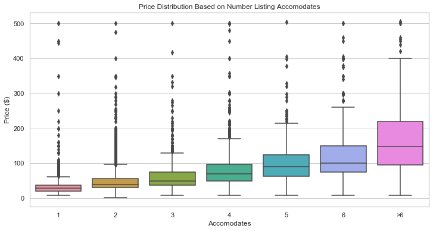

# Berlin Airbnb Project

## Purpose

The purpose of this project is to create a model that estimates the price an accomodation should be advertised for on Airbnb. The goal would be to create a resource that airbnb hosts could input the information of their property and the model would predict how much the property should be placed on airbnb for. The final model has a mean absolute error of $17.17.

## Data

The data for the project can be found on [kaggle](https://www.kaggle.com/brittabettendorf/berlin-airbnb-data).
The data was from 6 different csv files:

- Listings Summary
- Listings Detailed
- Neighbourhoods
- Calendar Summary
- Reviews Summary
- Reviews Detailed

The data should be downloaded and put in a file inside data/raw.

## Process

### Exploratory Data Analysis

I began by exploring the data to find useful columns and discover missing values. I created visualisations of the distributions of the features and their relationship with the target price variable. Some of the interesting plots:

I used a log scale to visualise the distribution of the price of listings as the data contained many outliers.

Using geopandas I plotted the location of the listings. 

I plotted the price distributions when seperated by the different categorical features, for example, comparing the distribution of price for listings that accomodate different numbers of people,

After perfoming exploritory data analysis of each table, I decided to only use the detailed listings table for my modelling. 

### Data Cleaning

The data cleaning that was done:

- I removed many columns I felt were not needed in the model or would have caused data leakage.
- I then converted the format of columns to be more useful to our model, by changing data in string form to numeric data.
- I removed the outliers in the price column from our model to make the target less heavily skewed.
- I filled missing data, using other columns where possible or, by using the data already in the column.
- I relabelled categorical values that had very few entries in a category.

### Feature Engineering

- I created indicator variables for some of the descriptive columns to show if the description was include, i.e. a neighbourhood overview indicator if the host included information about the neighbourhood.
- Using the latitude and longitude columns I calculated the distance from the centre and popular tourist attractions.
- Using the amenities column I created binary columns of amenities I felt may increase/decrease the value of the accomodation.
- From the descriptive columns I isolated any text that indicated the size of the listing. From this I gained information about the size of the listing for a quarter of the data, I then used a lasso model to fill the remaining entries.

### Modelling

- Feature selection. 

First, I removed highly correlated variables and created dummy variables for categorical features. I then tried to produce an optimal subset of the data using recursive feature elimination, this did not produce the desired results so I continued with the entire set of data.

- Modelling.

I trained four different regression models on my data, finding that a random forest produced the best results. Then I used the random forest to perform feature selection by using the relative importances of the features to produce a subset of the data that produced better results.

- Parameter tuning.

I did a random grid search with cross validation to find parameters that increased the performance of the random forest model. I then performed another grid search to find more accurately parameters that improved the performance further to produce my final model.

## Results

The final model metrics:

- Mean squared error: 874.32
- Root mean squared error: 29.56
- Mean absolute error: 17.17

My final model did not perform within a desirable error. The model did not perform well on listings with a higher price, this is likely due to the model missing useful information that could be hard to quantify or obtain. For example, the reputation, interior design or style of the listing, that could have a large effect on the price. 
